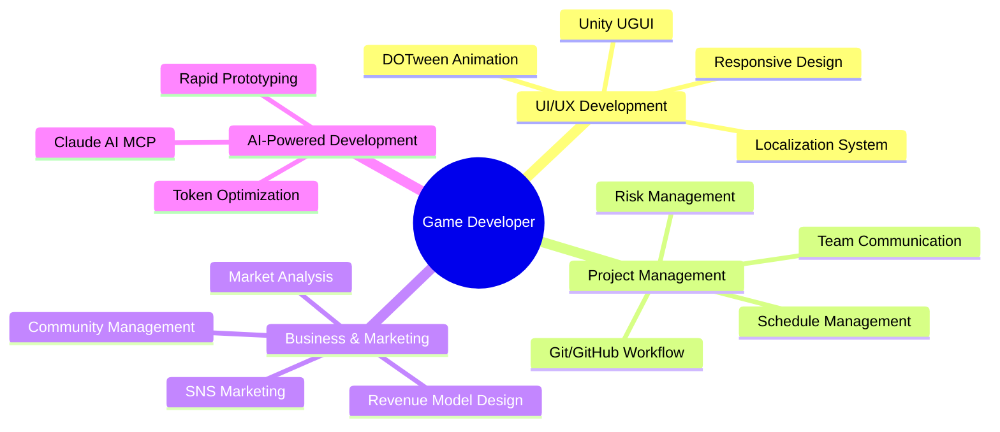

<div align="center">

# 🎮 Game Developer Portfolio

### UI/UX Developer → Project Manager
**개발자의 의도를 사용자에게 정확히 전달하는 게임을 만듭니다**

<br>

[](https://pocolgames.github.io/Portfolio/)
[](https://github.com/PocolGames)
[](mailto:dldmstn0409@gmail.com)

<br>

---

<br>

## 🚀 Portfolio Highlights

</div>

<table>
<tr>
<td width="50%">

### 🎨 **소울디바이스**
`UI/UX Development` `Steam Release`

- 7개국어 다국어 지원
- Unity UGUI 시스템 구축
- PM 역할로 프로젝트 완성 주도

</td>
<td width="50%">

### ♟️ **체스도쿠**
`Business Strategy` `Marketing`

- 시장성 분석 & 타겟팅
- 마케팅 전략 수립
- 수익화 모델 설계

</td>
</tr>
<tr>
<td width="50%">

### 📝 **UI/UX 재정비**
`Code Refactoring` `Documentation`

- 레거시 코드 리팩토링
- 개발 방법론 체계화
- 개발 일지 작성 습관화

</td>
<td width="50%">

### 🤖 **슬롯 꼬치**
`AI Development` `Rapid Prototyping`

- **6일 만에 게임 완성**
- AI 협업으로 생산성 70% 향상
- Google AdMob 광고 시스템

</td>
</tr>
</table>

<br>

<div align="center">

---

## 💼 Core Competencies

</div>



<br>

<div align="center">

---

## 🛠️ Tech Stack


<br>

---

## 📊 Growth Timeline

</div>

```
🎨 Phase 1: UI/UX Developer
   │
   ├─ Unity UGUI System Development
   ├─ DOTween Animation & UX Flow
   └─ Multi-language Support (7 languages)
   
📋 Phase 2: Project Manager
   │
   ├─ Git/GitHub Collaboration Setup
   ├─ Team Communication Process
   └─ Development Schedule Management
   
💼 Phase 3: Business Strategy
   │
   ├─ Market Analysis & Targeting
   ├─ Marketing Strategy Planning
   └─ Revenue Model Design
   
🤖 Phase 4: AI-Powered Innovation
   │
   ├─ 70% Development Speed Improvement
   ├─ Token Efficiency Optimization (90% reduction)
   └─ Solo Development with AI Collaboration
```

<br>

<div align="center">

---

## 🎯 What Makes Me Different

</div>

> **"단순히 기능을 구현하는 개발자가 아닌,**  
> **프로젝트의 성공을 위해 필요한 모든 역할을 수행할 수 있는 개발자"**

<div align="center">

| 🎨 User Experience | 📊 Project Management | 💼 Business Insight |
|:---:|:---:|:---:|
| 사용자 관점에서 생각하는 UI/UX | 팀 협업과 일정 관리 능력 | 시장성과 수익화 전략 |

<br>

---

## 📬 Contact

**이은수 (Lee Eunsu)**

[](mailto:dldmstn0409@gmail.com)
[](tel:010-6876-1121)
[](https://github.com/PocolGames)

<br>

---

<br>

## 🌟 Visit My Portfolio Website

### 👉 **[pocolgames.github.io/Portfolio](https://pocolgames.github.io/Portfolio/)** 👈

*더 자세한 프로젝트 정보와 개발 과정을 확인하실 수 있습니다*
